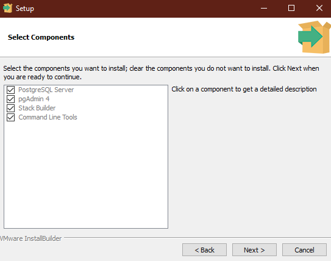

🅿🅾🆂🆃🅶🆁🅴🆂🆀🅻

# PostgreSQL-tutorial-documentation
A complete walk through guide to master on PostgreSQL

[Follow me on LinkedIn](https://www.linkedin.com/in/cinmoys-here/)

This Documentation includes:
- [Introduction](#introduction)
- [Installation](#installation)
- [Getting Started](#your-first-step)
 - [Creating Database](#creating-database)
 - [Connect database](#connecting-to-database)
 - [Creating Table](#creating-table)
 - [Insert into](#insert-into)

> I used Windows 10 (64-bit) operating system to run all the codes and procedures.

# 🚧 Installation

Make sure your hard disk have enough space for installation.Then Download the installer file from the link.Download the latest version of your computer architecture.
> [Download from here(For windows users)](https://www.enterprisedb.com/downloads/postgres-postgresql-downloads)

Other operating system users can download from this [link](https://www.postgresql.org/download/)

Run the installer file.Installation process is like any other software but make sure you mark the following items correctly.
- PostgreSQL Server
- pgAdmin
- Stack Builder
- Command Line Tools



After you finish you can run either `SQL Shell (psql)` for command line client or `pgAdmin 4` for GUI client.You are now ready to go.


# Your first step
As our pc serves as a server(database server) we need a client with which we can connect,view the contents and modify them. In Three ways we can do it.

- GUI client (`pgAdmin 4`)
- Terminal/cmd (`SQL Shell`)
- Application

I will use mostly terminal/cmd for my future works as it is a good habit and helps a lot during real projects.


Run the SQL Shell (psql).As you are running it for the first time your default server[localhost], Database [postgres], port [5432], Username [postgres].So you need to press just `enter`.Password is the superuser password that you set during installation.

<!-- <p align="center">
	
</p> -->

For windows you can operate from `command prompt` also.You have to add the `PostgreSQL` bin directory in the system path (add in path under environment variables).
Open command prompt.Run-

`psql -U postgres`

provide your superuser password.You are done.😁 

## Creating database
Before starting things be familiar with the terminal environment and basic navigation commands.
Remember psql or SQL commands are not case sensetive.But you are advised to use the **UPPERCASE** letter in the commands. 

Run - 

`CREATE DATABASE test;`

## Connecting to database

You can connect a database in a various way.
- **Case 1**
 - You can simply use this command to connect a database `cinmoy` if user remains same : `\c cinmoy`
- **Case 2**
 - If credentials are different then: `\c DBNAME USER HOST PORT`
- ** Case 3**
 - Or you can just connect from windows cmd : `psql DBNAME USER`

## Creating Table

To create a new table, you use the `CREATE TABLE` statement.
The following statement creates the `accounts` table:
```SQL

CREATE TABLE person (

	id BIGSERIAL NOT NULL PRIMARY KEY,
	first_name VARCHAR(50) NOT NULL,
	last_name VARCHAR(50) NOT NULL,
	gender VARCHAR(5) NOT NULL,
	date_of_birth DATE NOT NULL

);

```

**In this syntax:**

- Creating a table that already exists will result in a error. The IF NOT EXISTS option allows you to create the new table only if it does not exist. When you use the IF NOT EXISTS option and the table already exists, PostgreSQL issues a notice instead of the error and skips creating the new table.

- Specify a comma-separated list of table columns. Each column consists of the column name, the kind of data that column stores, the length of data, and the column constraint. The column constraints specify rules that data stored in the column must follow. For example, the not-null constraint enforces the values in the column cannot be NULL. The column constraints include not null, unique, primary key, check, foreign key constraints.

- Finally, specify the table constraints including primary key, foreign key, and check constraints.

> Note that some table constraints can be defined as column constraints like primary key, foreign key, check, unique constraints.Check them [here](https://www.postgresql.org/docs/9.4/ddl-constraints.html)

You can write this command in a line,like this:

<!-- <p align="center">
	
</p> -->

Or you can every colums seperately by pressing `enter` until a `;` is pressed:

<!-- <p align="center">
	
</p> -->

Then to describe all the tables simply run `\d`
<!-- 
<p align="center">
	
</p> -->

You can describe a table by `\d table_name`

<!-- <p align="center">
	
</p>
 -->
## Insert Into

Insert into is so simple.Just specify the columns name you want to insert into and write the values accordingly.
- If you want to insert all column values then you don't need to write the columns name.

- If your column data type is `BIGSERIAL` then you don't need to write the column name.

**Example:**

```SQL

INSERT INTO person(first_name, last_name, gender, date_of_birth)
VALUES('Cinmoy Das', 'Shuvro', 'Male', '1890/01/08');

```

Column `id` is on autocompletion.It is being counted and inserted autometically.

Or, if you want to insert into all columns then,simply:

```SQL

INSERT INTO person
VALUES('Cinmoy Das', 'Shuvro', 'Male', '1890/01/08');

```

<!-- <p align="center">
	
</p>
-->

> 🔞 Adults always uses constraints.

